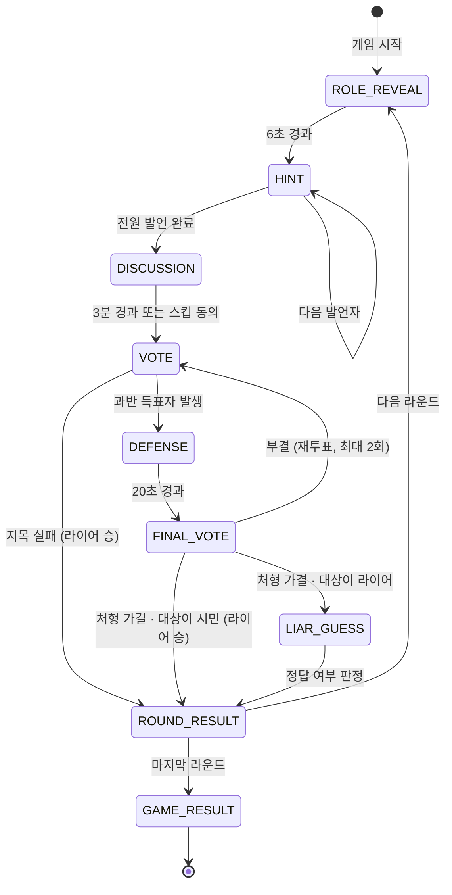

# LIAR

> 한 명은 정답을 모른다. 그런데 그 한 명도 자기가 누구인지 모른다.

브라우저에서 바로 즐기는 온라인 라이어 게임. 설치도 로그인도 없이 링크 하나로 최대 8명이 모여
한 판을 진행함. PC와 모바일 어디서 접속해도 같은 화면을 쓰고, 서버는 Docker 하나로 뜸.


---

## 목차

- [게임 규칙](#게임-규칙)
- [빠른 시작](#빠른-시작)
- [친구들에게 공유하기](#친구들에게-공유하기)
- [로컬 개발](#로컬-개발)
- [기술 스택](#기술-스택)
- [아키텍처](#아키텍처)
- [실시간 프로토콜](#실시간-프로토콜)
- [프로젝트 구조](#프로젝트-구조)
- [설계 노트](#설계-노트)
- [테스트](#테스트)
- [환경 변수](#환경-변수)

---

## 게임 규칙

### 기본 구조

라이어를 제외한 전원이 같은 제시어를 알고 있음. 라이어에게는 **같은 범주의 다른 단어**가 주어짐.
라이어에게 "당신이 라이어입니다"라고 알려 주지 않는 것이 이 게임의 핵심임. 라이어 본인도 자기가
거짓말을 하고 있다는 사실을 모른 채 힌트를 내야 하므로, 어색함이 자연스럽게 드러남.

| 항목 | 값 |
|------|-----|
| 입장 정원 | 2 ~ 8명 |
| 라운드 수 | 3 / 5 / 7 (방장이 게임 시작 전 언제든 변경) |
| 라이어 배정 | 매 라운드 새로 추첨 |
| 제시어 | 매 라운드 새로 추첨 (14개 범주, 168개 단어) |

### 한 라운드의 흐름

| 단계 | 시간 | 내용 |
|------|------|------|
| 제시어 확인 | 6초 | 각자 자기 단어를 확인. 발언 순서 공개 |
| 힌트 | 1인당 15초 | 한 명씩 돌아가며 힌트 한 마디. 이때 채팅 전면 금지 |
| 자유토론 | 3분 | 전원 채팅 가능. `/스킵` 으로 조기 종료 가능 |
| 지목 투표 | 30초 | 라이어로 의심되는 사람에게 투표 |
| 최후 진술 | 20초 | 최다 득표자만 발언 가능 |
| 생사 투표 | 20초 | 처형할지 살릴지 결정 |
| 마지막 반격 | 30초 | 처형된 사람이 라이어였다면 진짜 제시어를 맞힐 기회 |
| 라운드 결과 | 8초 | 정답과 라이어 정체 공개 |

### 승패와 점수

| 상황 | 결과 | 점수 |
|------|------|------|
| 라이어를 처형하고, 라이어가 제시어를 못 맞힘 | 시민 승 | 시민 전원 +1 |
| 라이어를 처형했지만 라이어가 제시어를 맞힘 | 라이어 승 | 라이어 +2 |
| 시민을 잘못 처형함 | 라이어 승 | 라이어 +2 |
| 과반 득표자가 없어 지목 실패 | 라이어 승 | 라이어 +2 |
| 라이어가 중도 이탈 | 라운드 무효 | 없음 |

### 세부 판정

- **`/스킵`**: 자유토론 중 `전체 인원 - 1` 명이 동의하면 즉시 투표로 넘어감. `/skip` 도 동일하게 인식함
- **과반 계산**: 기권을 포함한 전체 유권자 수 기준. 투표하지 않으면 사실상 반대표로 작용함
- **생사 투표**: 지목당한 본인은 자신의 생사에 투표할 수 없음
- **재투표**: 생사 투표가 부결되면 지목 투표를 다시 진행함. 단 한 라운드에 최대 2회까지만 시도하고,
  그 뒤에도 결론이 나지 않으면 지목 실패로 처리해 라운드를 끝냄
- **정답 인정 범위**: 라이어의 제시어 추측은 띄어쓰기와 영문 대소문자 차이를 무시하고 비교함
- **퇴장**: 게임 진행 중에는 나갈 수 없음. 브라우저를 닫으면 30초의 재접속 유예 후 이탈로 확정됨
- **인원 부족**: 남은 인원이 2명 미만이 되면 라운드 도중이라도 게임이 종료됨

---

## 빠른 시작

필요한 것은 Docker 뿐임. Windows, macOS, Linux 어디서든 같은 명령으로 동작함.

```bash
git clone https://github.com/<your-account>/liargame.git
cd liargame
docker compose up --build
```

브라우저에서 `http://localhost:8080` 접속.

같은 공유기에 붙은 휴대폰에서도 바로 들어올 수 있음. PC의 내부 IP를 확인해 `http://<PC의 IP>:8080`
으로 접속하면 됨.

```bash
# Windows
ipconfig

# macOS / Linux
ipconfig getifaddr en0 || hostname -I
```

포트를 바꾸려면 `WEB_PORT` 를 지정함.

```bash
WEB_PORT=3000 docker compose up --build
```

종료와 정리.

```bash
docker compose down
```

---

## 친구들에게 공유하기

같은 공유기에 없는 사람도 부르려면 로컬 서버를 인터넷에 잠깐 열어 주면 됨. 코드나 설정은 바꿀
필요가 없음. nginx 가 정적 파일과 API 와 WebSocket 을 모두 8080 하나로 묶어 두었고, 클라이언트가
접속 주소를 `window.location` 기준으로 만들기 때문에 https 터널이면 WebSocket 도 자동으로 `wss` 로
붙음.

### ngrok 사용

[ngrok 공식 다운로드 페이지](https://ngrok.com/downloads/windows)에서 받아 압축을 풀고, 계정
대시보드의 authtoken 을 한 번 등록함.

```bash
ngrok config add-authtoken <대시보드에서 복사한 토큰>
```

스택이 떠 있는 상태에서 터널을 염.

```bash
ngrok http 8080
```

출력에 나오는 `https://<임의의-이름>.ngrok-free.dev` 주소를 친구들에게 보내면 끝. 휴대폰에서도
그대로 들어옴.

알아 둘 점.

- 무료 플랜은 브라우저로 처음 들어갈 때 ngrok 경고 페이지가 한 번 뜸. **Visit Site** 를 누르면
  그 뒤로는 정상 동작하고, 같은 브라우저에서는 다시 뜨지 않음
- 주소는 터널을 다시 열 때마다 바뀜. 고정 주소가 필요하면 대시보드에서 무료 도메인을 하나 받아
  `ngrok http 8080 --url <받은-도메인>` 으로 실행함
- 내 PC 가 켜져 있고 `docker compose up` 이 돌아가는 동안만 접속됨
- 이 게임에는 로그인이 없음. 주소를 아는 사람은 누구나 들어와 방 목록을 볼 수 있으므로, 주소는
  같이 놀 사람에게만 보내고 끝나면 터널을 닫는 편이 좋음
- 백신이 ngrok 을 오탐으로 잡는 경우가 있음. 실행 파일 속성의 디지털 서명이 `ngrok, Inc.` 로
  유효한지 확인한 뒤 판단할 것

### 터널이 자꾸 끊긴다면

UDP 기반 터널(예: Cloudflare quick tunnel 의 기본 QUIC 모드)은 회선에 따라
`timeout: no recent network activity` 로 연결이 반복해서 끊길 수 있음. 터널이 끊기면 그 위의
WebSocket 이 전부 함께 죽으므로 게임 도중 전원이 튕긴 것처럼 보임. ngrok 은 TCP 기반이라 이
문제를 겪지 않음. Cloudflare 를 쓰던 중이라면 `--protocol http2` 를 붙여 TCP 로 강제하는 것으로도
같은 증상이 해결됨.

---


## 로컬 개발

Docker 없이 두 서버를 따로 띄우는 방식. 코드 수정이 즉시 반영됨.

**필요 사항**: JDK 21 이상, Node.js 20 이상

```bash
# 1) 백엔드 (http://localhost:8080)
cd server
./gradlew bootRun

# 2) 프런트엔드 (http://localhost:5173)
cd client
npm install
npm run dev
```

Vite 개발 서버가 `/api` 와 `/ws` 요청을 백엔드로 넘겨 주므로, 브라우저 입장에서는 배포 형상과
똑같이 한 출처로 보임. 백엔드 주소가 다르면 `VITE_API_TARGET` 으로 지정함.

Gradle 래퍼 없이 컨테이너로만 빌드하고 싶다면 다음처럼 실행할 수 있음.

```bash
docker run --rm -v "$PWD/server:/build" -w /build gradle:8.14-jdk21 gradle --no-daemon test
```

---

## 기술 스택

| 계층 | 선택 | 이유 |
|------|------|------|
| 서버 | Java 21, Spring Boot 3.4 | 레코드·패턴 매칭·봉인 스위치로 상태머신을 간결하게 표현 |
| 실시간 | STOMP over WebSocket (내장 브로커) | 주제 구독과 개인 채널을 별도 구현 없이 나눌 수 있음 |
| 저장 | 프로세스 메모리 | 게임이 끝나면 남길 데이터가 없어 DB가 불필요. 인터페이스 뒤에 두어 교체 가능 |
| 클라이언트 | React 19, TypeScript 5.8 | 서버 스냅샷을 그대로 그리는 구조에 적합 |
| 상태 관리 | Zustand | 소켓 수명이 컴포넌트 밖에 있어야 해서, 스토어가 가벼울수록 유리 |
| 스타일 | Tailwind CSS v4 | 디자인 토큰을 CSS 변수로 두고 유틸리티와 함께 씀 |
| 빌드 | Vite 6 | 개발 서버 프록시로 배포 형상과 동일한 출처 구성 |
| 배포 | Docker Compose (nginx + JVM) | 로컬 환경에 JDK·Node 가 없어도 동일하게 기동 |

---

## 아키텍처

### 배포 형상

```
                        브라우저 (PC / 모바일)
                                |
                     http://localhost:8080
                                |
                   +------------v------------+
                   |   web  (nginx:alpine)   |
                   |  정적 파일 + 리버스 프록시  |
                   +------------+------------+
                       /api     |     /ws
                   +------------v------------+
                   |  api  (JRE 21, 비루트)   |
                   |  Spring Boot + STOMP    |
                   +-------------------------+
```

브라우저에 노출되는 포트는 하나뿐임. nginx 가 정적 파일을 서빙하면서 `/api` 와 `/ws` 를 백엔드로
넘기므로 CORS 설정이 필요 없고, WebSocket 도 같은 출처로 붙음.

### 계층 구조

의존 방향이 항상 안쪽을 향함. 도메인은 스프링도 네트워크도 시계도 모름.

```
interfaces  ──▶  application  ──▶  domain
    │                 │              ▲
    │                 └── port ──────┘
    │                       ▲
    └──────  infrastructure ┘
```

| 패키지 | 책임 | 바깥 의존 |
|--------|------|-----------|
| `domain` | 게임 규칙 판단. Game, Round, Room, Ballot | 없음 (순수 자바) |
| `application` | 유스케이스 조립, 잠금, 타이머 예약, 뷰 변환 | 스프링 애너테이션만 |
| `application.port` | 저장소·발행기·지연 실행기 계약 | 없음 |
| `infrastructure` | 인메모리 저장소, STOMP 발행, 스케줄러, 단어 사전 | 스프링, Jackson |
| `interfaces` | REST 컨트롤러, WebSocket 컨트롤러, 세션 리스너 | 스프링 MVC/메시징 |

### 라운드 상태 전이



### 단계 전이를 트리거하는 두 경로

1. **제한 시간 만료** — 예약된 타이머가 `Game.onTimeout()` 호출
2. **완료 조건 충족** — 전원이 투표를 마치면 남은 시간을 기다리지 않고 즉시 전이

두 경로가 동시에 존재하므로, 조기 전이로 무의미해진 타이머가 뒤늦게 터져 단계를 건너뛰는 사고가
생길 수 있음. 이를 막기 위해 전이마다 증가하는 **단계 토큰**을 둠. 타이머는 예약 당시의 토큰을
들고 있다가 발화 시점에 값이 다르면 스스로 폐기함.

---

## 실시간 프로토콜

### 연결

```
ws(s)://<host>/ws?roomId=<방 코드>&playerId=<입장권>
```

`playerId` 는 방에 입장할 때 서버가 발급하는 UUID 이며, 이후 본인을 증명하는 값으로 쓰임.
행동의 주체는 항상 이 접속 주체에서 가져오므로, 남의 이름으로 투표하거나 발언할 수 없음.

### 구독 채널

| 채널 | 내용 |
|------|------|
| `/topic/room/{roomId}` | 방 전체 공개 상태와 대화 |
| `/user/queue/private` | 본인만 받는 제시어와 오류 안내 |
| `/topic/lobby` | 방 목록 변경 |

### 클라이언트에서 보내는 명령

모두 `/app/room/{roomId}/...` 로 전송함.

| 목적지 | 본문 | 설명 |
|--------|------|------|
| `sync` | `{}` | 현재 상태 전체를 다시 요청 |
| `chat` | `{ text }` | 대화. `/스킵` 은 여기서 명령으로 가로챔 |
| `hint` | `{ text }` | 힌트 제출 (자기 차례에만) |
| `vote` | `{ targetId }` | 라이어 지목 |
| `final-vote` | `{ approve }` | 처형 찬반 |
| `guess` | `{ word }` | 라이어의 제시어 추측 |
| `start` | `{}` | 게임 시작 (방장) |
| `settings` | `{ totalRounds }` | 라운드 수 변경 (방장) |
| `return-to-lobby` | `{}` | 결과 화면 닫기 (방장) |

### 서버에서 보내는 메시지

`{ "type": ..., "payload": ... }` 봉투로 통일함.

| 타입 | 내용 |
|------|------|
| `ROOM_STATE` | 방 전체 상태 스냅샷 |
| `CHAT` | 새 대화 한 줄 |
| `CHAT_HISTORY` | 입장·재접속 시 대화 기록 전체 |
| `SECRET` | 본인 제시어 (개인 채널) |
| `ROOM_LIST` | 방 목록 |
| `ERROR` | 요청 거절 사유 (개인 채널) |
| `CLOSED` | 방이 닫힘 |

### REST

| 메서드 | 경로 | 설명 |
|--------|------|------|
| `GET` | `/api/rooms` | 방 목록 |
| `POST` | `/api/rooms` | 방 생성. 입장권 발급 |
| `POST` | `/api/rooms/{roomId}/players` | 방 입장. 입장권 발급 |
| `DELETE` | `/api/rooms/{roomId}/players/{playerId}` | 대기실에서 나가기 |

---

## 프로젝트 구조

```
liargame/
├── docker-compose.yml            2컨테이너 구성
├── server/                       Spring Boot
│   ├── Dockerfile                Gradle 빌드 → JRE 실행 (멀티스테이지)
│   └── src/main/java/com/liargame/
│       ├── domain/               규칙. 프레임워크 의존 없음
│       │   ├── game/             Game, Round, Ballot, GamePhase, GameRules
│       │   ├── room/             Room, RoomId, RoomSettings, ChatMessage
│       │   ├── player/           Player, PlayerId, Nickname
│       │   └── word/             WordPair, WordPairProvider
│       ├── application/
│       │   ├── port/             RoomRepository, RoomEventPublisher, DelayedExecutor
│       │   ├── service/          RoomService, GameFlowService, PlayerSessionService
│       │   └── view/             클라이언트로 나가는 뷰 모델
│       ├── infrastructure/       인메모리 저장소, STOMP 발행, 스케줄러, 단어 사전
│       ├── interfaces/           REST · WebSocket 진입점
│       └── config/               WebSocket, CORS, 빈 정의
└── client/                       React + TypeScript
    ├── Dockerfile                Vite 빌드 → nginx 서빙
    ├── nginx.conf                SPA 폴백 + API/WS 프록시
    └── src/
        ├── components/
        │   ├── scene/            전구·책상·리볼버 SVG
        │   ├── room/             좌석, 힌트판, 채팅, 액션바, 결과 오버레이
        │   └── ui/               패널, 카운트다운, 토스트
        ├── pages/                입장 · 로비 · 게임방
        ├── store/                방 상태와 소켓 수명 관리
        ├── hooks/                카운트다운, 로비 목록
        ├── lib/                  REST, STOMP, 저장소, 단계 메타
        └── styles/               디자인 토큰, 전역 스타일
```

---

## 설계 노트

### 서버가 진실의 유일한 출처

클라이언트는 상태를 스스로 굴리지 않음. 변경이 생길 때마다 서버가 **전체 스냅샷**을 다시 내려
주고, 클라이언트는 그것을 그대로 그림. 최대 8명짜리 방이라 스냅샷이 작고, 부분 갱신을 쓰지 않으니
클라이언트와 서버의 상태가 어긋날 여지가 처음부터 사라짐.

### 라이어 정체는 서버 밖으로 나가지 않음

공개 상태(`GameView`)에는 제시어도 라이어 정보도 들어 있지 않음. 각자의 제시어는 개인 채널로만
가고, 정답과 라이어 정체는 라운드가 끝난 뒤 `RoundResultView` 로 처음 공개됨. 개발자 도구를 열어도
미리 알 수 없음.

### 시간은 흐르지 않고 "끝나는 시각"만 전달됨

서버는 1초마다 남은 시간을 밀어 주지 않고 단계 종료 시각(epoch ms)만 한 번 보냄. 클라이언트가
그 값으로 카운트다운을 그림. 스냅샷에 서버 시각이 함께 담겨 있어 브라우저 시계가 어긋나 있어도
보정됨.

### 끊김과 이탈을 구분함

모바일은 화면을 잠그기만 해도 연결이 끊김. 끊김을 곧바로 이탈로 보면 게임이 수시로 망가지므로,
30초의 재접속 유예를 두고 그 안에 돌아오지 않은 경우에만 이탈로 확정함. 다시 붙으면 같은 입장권으로
자기 자리와 제시어를 그대로 되찾음.

### 동시성은 방 단위 잠금 하나로 끝냄

한 방의 상태를 건드리는 경로가 셋임 — 사용자 요청, 단계 타이머, 접속 끊김 처리. 이들을 방 단위
`ReentrantLock` 으로 직렬화해서, 도메인 코드는 동시성을 전혀 신경 쓰지 않아도 되게 함. 잠금 범위가
항상 방 하나로 끝나므로 교착이 생길 수 없음.

### SOLID 적용 지점

| 원칙 | 적용 |
|------|------|
| 단일 책임 | `RoomService`(방 생명주기) / `GameFlowService`(게임 진행) / `PlayerSessionService`(접속) 을 분리. 뷰 변환은 `RoomViewAssembler` 한 곳에만 둠 |
| 개방·폐쇄 | 새 서버 메시지 타입을 추가해도 기존 처리기를 고칠 필요가 없는 봉투 구조 |
| 리스코프 치환 | `WordPairProvider`, `RoundRandomizer` 는 테스트용 고정 구현으로 바꿔도 게임 규칙이 동일하게 성립 |
| 인터페이스 분리 | `RoomRepository`, `RoomEventPublisher`, `DelayedExecutor` 를 각각 필요한 만큼만 좁게 정의 |
| 의존 역전 | 도메인과 애플리케이션은 포트 인터페이스만 알고, 구현체는 `infrastructure` 에서 주입됨 |

### 화면 설계

어두운 방, 천장의 전구 하나, 낡은 책상 위의 리볼버. 색은 세 갈래로만 씀.

- **어둠** — 배경과 깊이
- **등불** — 지금 주목해야 할 것 (내 차례, 남은 시간, 방장)
- **피** — 되돌릴 수 없는 것 (투표, 처형, 라이어)

중앙 장면은 순수 SVG 라 외부 이미지 요청이 없고 어떤 해상도에서도 선명함. 넓은 화면에서는 책상을
둘러싸고 둥글게 앉히고, 좁은 화면에서는 장면을 접은 뒤 목록으로 세움. 두 배치 모두 "나"를 맨 앞에
두어 자기 자리를 찾는 데 시간을 쓰지 않게 함.

단계마다 허용되는 행동이 완전히 다르므로, 하단 입력 바에는 **지금 할 수 있는 행동 하나만** 남김.

### 한 화면 안에서 끝남

게임 화면은 높이를 화면에 못박고, 스크롤은 힌트 목록과 대화 안쪽에서만 일어남. 머리(단계·남은
시간)와 하단 입력 바는 어떤 경우에도 자리를 뜨지 않음. 30초 안에 투표해야 하는 게임에서 입력창을
찾으러 스크롤을 내리는 일이 없어야 하기 때문임.

높이가 유한해지면 모든 요소가 서로의 자리를 뺏는 관계가 되므로, 자리를 차지할 값어치가 있는지를
하나씩 따졌음.

| 정리한 것 | 이유 |
|-----------|------|
| 머리의 단계별 안내 문구 | 하단 입력 바가 같은 말을 이미 하고 있었음 |
| 좌석의 두 줄 구성 | 8명이면 그대로 여덟 배가 됨. 이름·점수·득표를 한 줄에 담음 |
| 좁은 화면의 전구 장면 | 정보가 아니라 분위기인데 128px 을 썼음. 천장 조명은 배경이 이미 만듦 |
| 힌트판과 대화의 세로 배치 | 둘 다 쌓이는 기록이라 나눠 가지면 양쪽 다 반쪽이 됨 |

마지막 항목이 가장 큼. 좁은 화면에서는 힌트와 대화를 **탭으로 겹쳐** 남는 높이를 통째로 한쪽에
줌. 탭은 안 보이는 쪽을 잊게 만드는 것이 약점이라, 단계가 바뀔 때 그 단계에서 봐야 할 쪽으로
알아서 넘어가고(힌트 순서에는 힌트, 토론이 열리면 대화), 힌트를 보는 동안 쌓인 대화 수를 탭에
표시함. 자동 전환은 단계가 바뀌는 순간에만 일어나므로, 사용자가 직접 고른 탭을 빼앗지 않음.

넓은 화면은 높이가 남으므로 나누지 않음. 힌트판과 대화가 각자 자리를 갖고, 남는 높이는 책상을
둘러싼 원형 배치가 받아 씀.

### 긴장은 '상태'가 아니라 '순간'에 붙임

색으로 단계를 구분하는 것만으로는 밋밋함. 투표 단계에 **있는 동안** 화면이 붉어도, 투표 단계로
**넘어가는 순간**에 아무 일도 없으면 구두점 없는 문장처럼 읽힘. 그래서 서버 스냅샷을 이전 값과
비교해 결정이 내려지는 순간을 찾아내고, 그 순간에만 한 번씩 터뜨림.

| 순간 | 화면 | 소리 |
|------|------|------|
| 단계 전환 | 천장 전구가 한 번 크게 번짐 | 낮은 숨소리 |
| 내 힌트 차례 | 좌석에 등불 테두리 | 맑은 종소리 (유일하게 밝은 소리) |
| 표가 꽂힘 | 득표 수 갱신 | 마른 클릭음 |
| 지목 확정 | 전구가 흔들림 | 아래로 미끄러지는 음 |
| 처형 가결 | 전구가 흔들림 | 가장 무거운 한 방 |
| 되돌릴 수 없는 단계 | 마지막 10초에 가장자리가 붉게 맥박침 | 심장박동 (남은 20초부터 가속) |
| 라운드 결과 | 붉은 번짐 | 라이어 승은 단3도 하행, 시민 승은 완전5도 상행 |

되돌릴 수 없는 단계에서는 남은 시간이 줄수록 심장박동이 빨라짐(60 → 150 bpm). 화면 가장자리의
맥박도 **같은 주기**를 써서 눈과 귀가 어긋나지 않게 함.

3분짜리 자유토론을 여러 판 도는 게임이라 연출이 과하면 금방 피로해짐. 그래서 늘 켜져 있는 것은
없고 전부 짧게 지나가며, `prefers-reduced-motion` 이 켜져 있으면 전부 정지함.

### 소리는 파일이 아니라 코드로 만듦

음원을 하나도 두지 않고 Web Audio 로 직접 합성함. 이유가 셋 있음.

- 저작권을 따질 대상이 아예 생기지 않음
- 받아 올 파일이 없으니 첫 진입이 느려지지 않고 레포도 무거워지지 않음
- **심장박동이 남은 시간에 맞춰 실시간으로 빨라져야 하는데, 녹음된 루프로는 못 함**

배경음은 55Hz 근처의 살짝 어긋난 두 음과 브라운 노이즈를 저역 필터에 통과시킨 드론임. 두 음이
서로 맥놀이를 일으켜 가만히 있어도 소리가 미세하게 흔들림. 긴장 단계에서는 필터가 열리며 소리가
앞으로 나옴 — 화면이 붉어지는 것과 같은 신호를 귀로도 주는 것.

브라우저는 사용자가 화면을 한 번 건드리기 전에는 소리를 내주지 않으므로, 첫 입력에서 오디오를
열고 그 전까지의 요청은 조용히 버림. 탭을 벗어나면 소리도 함께 물러남.

### 소리는 두 갈래로 나눠 조절함

방 화면 우상단의 스피커 아이콘을 누르면 음소거와 두 개의 음량 손잡이가 열림.

| 갈래 | 담는 소리 |
|------|-----------|
| 배경음 | 깔리는 드론과 심장박동 |
| 효과음 | 단계 전환·내 차례·투표·처형 |

하나로 묶지 않은 이유는, 계속 깔려 있는 소리는 부담스러워도 결정의 순간을 알려 주는 소리는
남기고 싶은 사람이 있기 때문임. 묶어 두면 그 선택 자체를 할 수 없음.

손잡이 위치는 게인에 그대로 꽂지 않고 제곱을 걸어 옮김. 사람 귀는 진폭에 선형으로 반응하지
않아서, 막대를 절반으로 내렸는데 게인도 절반이면 별로 줄어든 것 같지 않게 들림.

음소거와 두 음량 모두 브라우저에 남으므로 다음에 들어와도 그대로임.

---

## 테스트

```bash
cd server
./gradlew test
```

도메인 규칙을 실시간 대기 없이 검증함. 무작위성과 시각을 모두 주입받는 구조라 라운드 전체를
결정적으로 재현할 수 있음.

| 대상 | 검증 내용 |
|------|-----------|
| `GameTest` | 제시어 배분, 힌트 순서, 스킵 임계값, 과반 판정, 재투표 상한, 라이어 반격, 중도 이탈, 단계 토큰 |
| `RoomTest` | 정원, 게임 중 입장 차단, 방장 위임, 설정 권한, 단계별 채팅 허용 |
| `NicknameTest` | 제어문자·폭 없는 문자·방향 조작 문자 제거, 길이 규칙 |

---

## 환경 변수

| 변수 | 대상 | 기본값 | 설명 |
|------|------|--------|------|
| `WEB_PORT` | compose | `8080` | 브라우저가 접속할 포트 |
| `ALLOWED_ORIGINS` | api | `*` | 허용할 출처. nginx 뒤에서는 같은 출처라 의미 없음 |
| `API_LOG_LEVEL` | api | `INFO` | `DEBUG` 로 올리면 접속·종료가 로그에 남음 |
| `VITE_API_TARGET` | client (개발) | `http://localhost:8080` | Vite 개발 서버가 프록시할 백엔드 주소 |

---

## 라이선스

MIT
